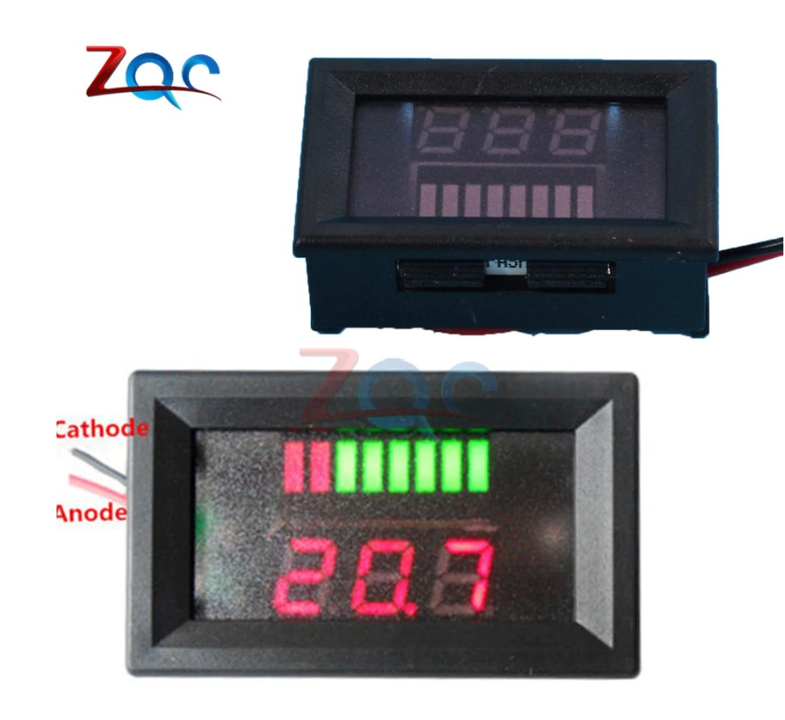
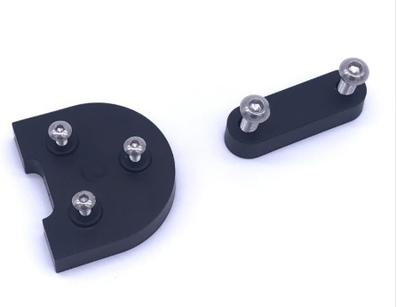
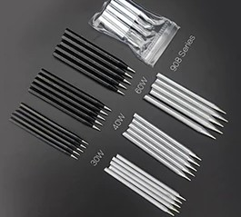

# 18650

 ### Magazine

| Фото | Описание |  |
| :---         |     :---:      |          ---: |
|      | 3 USB 7x18650 батарея DIY банк питания коробка держатель чехол ЖК-дисплей батарея зарядка для мобильного телефона ПК с светодиодный фонарик   Комплект: 1 шт. Наличие: 1 кмпл. | <a href="https://aliexpress.ru/item/33046035975.html" rel="some text">Магазин</a> 287+150= 437     
|      | Шлейф BMS Xiaomi M365  Комплект: 1 шт. Наличие: 2 кмпл. |  300+150= 450
|      | BMS Xiaomi M365  Комплект: 1 шт. Наличие: 2 кмпл. |  1437+250= 1687
|      | Контроллер Xiaomi M365  Комплект: 1 шт. Наличие: 2 кмпл. |  1863+337= 2250
|      | BMS 16s Battery Tester 16S 30A Lithium Battery Protect Board BMS P C B Board with Balance Charging Testing Equipment  Комплект: 1 шт. Наличие: 2 кмпл. |  1050
|      | BMS 10S 30A Mini Lithium Battery Protect Board BMS Комплект: 1 шт. Наличие: 2 кмпл. |  542+308= 850
|     | BMS 12S 40A Lithium Battery Protect Board BMS Комплект: 1 шт. Наличие: 2 кмпл. |  2000
|     | Головная плата Xiaomi Mijia M365 Комплект: 1 шт. Наличие: 3 кмпл. |  1000+400= 1400
|      | 6 в/12 В/36 В/48 в красный светодиодный индикатор Характеристики: 36V/48V/Green/Red Комплект: 1 шт. Наличие: 3 кмпл.(разн.) |  160+100= 260
|      | Батарея зарядки Интерфейс отверстие Кепки для Xiaomi Mijia M365 электрический скутер Запчасти Комплект: 1 шт. Наличие: 1 кмпл. |  180+150= 330
|      | 100% оригинал лиитокала для M26 18650 2600 мА/ч, 10A 2500 литий-ионная аккумуляторная батарея питания безопасный аккумулятор для электронных сигарет/скутер Комплект: 1 шт. Наличие: 123 кмпл. |  135+75= 210
|      | Liitokala 18650 батарея HG2 3000 мАч 3,6 В литиевая непрерывная разрядка 20A выделенная электронная батарея питания Комплект: 1 шт. Наличие: 123 кмпл. |  170+60= 230
|      | Liitokala 18650 батарея HG2 3000 мАч 3,6 В литиевая непрерывная разрядка 20A выделенная электронная батарея питания Комплект: 1 шт. Наличие: 10 кмпл. |  210+150= 360
|      | Универсальная BMS Aihasd 100A 1S-5S 21V Li-Ion LMO Ternary литиевая батарея, защитная печатная плата Комплект: 1 шт. Наличие: 10 кмпл. |  360+150= 510
|     | Активный балансир Li-Ion Lifepo4 BMS 3S 4S 5S 6S 7S 8S 10S Комплект: 1 шт. Наличие: 1 кмпл. |  1400+300= 1700
    | BMS 3s 100A 12V Li-Ion, защитная печатная плата Комплект: 1 шт. Наличие: 2 кмпл. |  360+150= 500
|      |  Заднее крыло для Xiaomi, скутер M365, брызговик, защита M365 Pro Комплект: 1 шт. Наличие: 4 кмпл. |  610+150= 760
|      |  Xiaomi M365 - поддержка крыла (8" или 10" колеса) Комплект: 1 шт. Наличие: 1 кмпл. бел, 1 кмпл. чер. |  610+150= 760
|     |  Детская ручка, сумка, держатель для бара, ручка с предупредительным сигналом безопасности для Xiaomi Mijia M365 Комплект: 1 шт. Наличие: 1 кмпл. |  780+320= 1100
|     |  Детская ручка, сумка, держатель для бара, ручка с предупредительным сигналом безопасности для Xiaomi Mijia M365 Комплект: 1 шт. Наличие: 1 кмпл. |  680+320= 1000
|     |  VERTVIE 2 шт./1 пара, Грипсы, велосипеда, гладкая мягкая резиновая противоскользящая ручка Комплект: 2 шт. Наличие: 1 кмпл. |  300+100= 400
|     |  2 шт., Грипсы для M365, силиконовые ручки для руля Комплект: 2 шт. Наличие: 1 кмпл. |  500+150= 650
|      |   Светоотражающая наклейка "Рептилия" для безопасности. Размеры: 11,6 см * 11 см. Функция: Предупреждение о безопасности, украшение, покрытие царапин и т. д. Комплект: 1 шт. Наличие: [2 кмпл. Синяя, 2 кмпл. Красная, 2 кмпл. Белая]|  128+32= 160
|      |   Светоотражающая наклейка "Крылышки" для безопасности. Размеры:  10 см * 8,9 см Комплект: 2 шт. Наличие: [1 кмпл. Синяя, 1 кмпл. Красная, 1 кмпл. Зеленая]|  128+32= 160
|      |   Светоотражающая наклейка "Треугольник" для безопасности. Размеры:  14,3 см * 4,5 см. Комплект: 1 шт. Наличие: [1 кмпл. Синяя, 1 кмпл. Красная]|  330+100= 430
|      |   Светоотражающая наклейка "Рулон" для безопасности. Размеры: 5 см * 300 см. Комплект: 1 шт. Наличие: [1шт. желт, 1шт красн, 2шт. бел.]|  200+100= 300
|      | Светодиодная лента SMD3528 12v водонепроницаемая гибкая 30 см [красный и желтый] супер яркий Стайлинг Декор наклейки на лампу  Комплект: 2 шт. Наличие: [1 кмпл. Желтая, 1 кмпл. Красная]|   <a href="https://aliexpress.ru/item/32976920397.html" rel="some text">Магазин</a> 150     |
|      |  Обжимные клеммы 6,3 мм Комплект: 1 шт., 1 гнездовых разъемов и 1 штекерных разъемов с корпусами. Наличие: 100 кмпл.|  20 |
|      |  Обжимные клеммы 6,3 мм 6,3 мм флаг правый угол флаг L Т+ крышка Изолированная Сварка 0,5-1,5 мм2 Комплект: 1 шт., 1 штекерный разъем с корпусами. Наличие: 100 кмпл.|  20 |
|      |  42V 2A зарядное устройство для 36В литий-ионная литиевая батарея Комплект: 1 шт. Наличие: 3 кмпл.|  600+200= 800 |
|      |  42V 2A зарядное устройство для Xiaomi M365 б.У Комплект: 1 шт. Наличие: 3 кмпл.|  1500 |
|      |  Зарядное устройство VOXLINK 18650 EU Plug 2 слота литий-ионная аккумуляторная батарея зарядное устройство 4.8 Комплект: 1 шт. Наличие: 3 кмпл.|  180+180= 360 |
|      |  Лак обмоточный REXANT Комплект: 1 шт. Наличие: 2 кмпл.|  300 |
|      |  Зарядное устройство зарядное устройство для литиевых батарей, 21 В 1 А, 5,5 мм * 2,1 мм Комплект: 1 шт. Наличие: 3 кмпл.|  370+180= 550 |
|      | Кнопка включения и выключения двигателя, аксессуары для мотоциклов, мини-мотоцикл, квадроцикл, 22 мм, 7/8 дюйма Комплект: 1 шт. Наличие: 3 кмпл.|  220+180= 400 |
|      | Высокоточный манометр для автомобильных шин, мини-манометр Комплект: 1 шт. Наличие: 3 кмпл.|  330+170= 500 |
|    | Ножка для Xiaomi Mijia M365 Комплект: 1 шт. черн. Наличие: 2 кмпл.|  360+170= 530 |
|    | Термоскотч. Температурная изоляция, полиамидная клейкая каптоновая лента, 30мм Комплект: 1 шт. Наличие: 2 кмпл.|  290+150= 440 |
|    |Водонепроницаемый велосипедный держатель для мобильного телефона, чехол для телефона на руль с креплением для велосипеда Комплект: 1 шт. Наличие: 3 кмпл.|  450+150= 600 |
|    |Высокотемпературный силиконовый резиновый герметик, герметичный клей, герметик 703-бел,жидк/704-бел. или черн. - средн./705-прозрачн. Комплект: 1 шт. Наличие: 3 кмпл.|  450+150= 600 |
|    |505 0196 Rema Tip-Top -	Вулканизирующая жидкость для камерных заплат 175г/250мл. Комплект: 1 шт. Наличие: 3 кмпл.|  700+300= 1000 |
|    |Проставки (прокладка) для 10" колес Xiaomi m365 Комплект: 2 шт. Наличие: 1 кмпл. бел, 1 кмпл. черн.|  250+100= 350 |
|    | Японские водонипроницаемые подшипники Xiaomi m365 Комплект: 4 шт. Наличие: 1 кмпл. |  1100 |
|    | Зарядное устройство 12s 50.4V 2A Комплект: 1 шт. Наличие: 1 кмпл. |  1100 |
|    | Рычаг газа на левый большой палец Комплект: 1 шт. Наличие: 1 кмпл. |  720+180 = 1000 |
|    |  8,5 "Модернизированная камера для Xiaomi Mijia M365 Комплект: 1 шт. Наличие: 2 кмпл. |  400 |
|    | Светодиодная фара "Сова", 2 светодиода, 12~84 В, 20 Вт, 6000 К, белая, супер яркая, для мотоцикла Комплект: 1 шт. Наличие: ~2 кмпл. |  750 |
|    | Светодиодная фара "CY-D16", 4 светодиода, 12~84 В, белая, супер яркая, для мотоцикла Комплект: 1 шт. Наличие: 1 кмпл. |  900 |
|    | Светодиодный головной фонарь SAARMAT One, 15 Вт, для мотоцикла, белый, DRL, противотуманный фонарь, аксессуары для электрического автомобиля Комплект: 1 шт. Наличие: 1 кмпл. |  1300 |
|    |  Светодиодный головной фонарь SAARMAT One, 10 Вт, для мотоцикла, белый, DRL, противотуманный фонарь, аксессуары для электрического автомобиля Комплект: 1 шт. Наличие: 1 кмпл. |  1000 |
|    | Никелевая лента для Li 18650 батарей, совместима с точечной сваркой Комплект: 1 м. Наличие: 10 кмпл. |  150 |
|    | 1S 18650 литий-ионная прокладка для изоляции аккумулятора Комплект: 50 шт. Наличие: 8 кмпл. |  100 |
|    |  2S 18650 литий-ионная прокладка для изоляции аккумулятора Комплект: 9 шт. Наличие: 8 кмпл. |  40 |
|    | Мотор колесо для M365, оригинал, б\у, нужна замена провода!  Комплект: 1 шт. Наличие: 1 кмпл. |  1700 |
|    | K37, Бесщеточный контроллер постоянного тока 350 Вт, 36 В/48 В, 6 MOFSET, (простой), контроллер двигателя Комплект: 1 шт. Наличие: 1 кмпл. |  880+320 = 1200 |
|    | K36, Новый 36V/48V 350W бесколлекторный мотор контроллер для электрического велосипеда E-велосипед Скутер бесщеточный контроллер постоянного тока без щетки Комплект: 1 шт. Наличие: 1 кмпл. |  760+340 = 1100 |
|    | К33, Бесщеточный контроллер 500 Вт DC60V 12 MOFSET, контроллер двигателя BLDC/контроллер скорости Электронного велосипеда/электронного скутера/электрического велосипеда Комплект: 1 шт. Наличие: 1 кмпл. |  2100+500 = 2600 |
|    | K35, 67,2 в 1.5A зарядное устройство 60 в 1.5A адаптер питания для 60В 16с литий-ионная батарея для электровелосипеда Комплект: 1 шт. Наличие: 1 кмпл. |  1030+270 = 1300 |
|    | K34, 60V 67.2V 2.5A зарядное устройство для 16S Li-Ion Lipo батареи Комплект: 1 шт. Наличие: 1 кмпл. |  1210+390 = 1600 |
|    | K29, 72В 20ач умное зарядное устройство перезаряжаемая свинцово-кислотная батарея зарядное устройство адаптер Электрический велосипед Скутер зарядное устройство DC 8В 2.8A Комплект: 1 шт. Наличие: 2 кмпл. |  1420+380 = 1800 |
|    | K19, 54,6 в выход 2A 13 S 48 В литий-ионный аккумулятор DC 54,6 в литий-полимерный аккумулятор зарядное устройство Комплект: 1 шт. Наличие: 2 кмпл. |  1070+230 = 1300 |
|    | K17, 220 В 60 Вт Электрический паяльник нагревательный инструмент горячий припой Инструменты для ремонта тепла с европейской вилкой противоскользящая ручка Комплект: 1 шт. Наличие: 2 кмпл. |  270+130 = 400 |
|    | K18, Наконечник (жало) паяльника 60 Вт Комплект: 1 шт. бел./черн. Наличие: 5 кмпл. |  100+50 = 150 |
|    | K16, Литий-ионное  зарядное устройство для аккумуляторной батарея Li-ion, 12,6 В, 1А, 3 с, 12 В, 5,5 х 2,1 мм Комплект: 1 шт. Наличие: 3 кмпл. |  285+115 = 400 |
|    | K15, 54,6 V 3A зарядное устройство для 13S 48V литий-ионная батарея электрический велосипед литиевая батарея зарядное устройство Высокое качество сильное тепловыделение Комплект: 1 шт. Наличие: 2 кмпл. |  1200+300 = 1500 |
|    | Пневматическая шин покрышка для Xiaomi M365 10 дюймов, ударопрочная труба 10x2 Комплект: 1 шт. Наличие: 4 кмпл. |  780+220 = 1100 |
|    | K13, 72V 20S 45A литий-ионная 18650 батарея Bms Pcb плата с защитой баланс доска модуль для электрического мотоцикла E-Bike Комплект: 1 шт. Наличие: 2 кмпл. |  1170+330 = 1500 |
|    | K41, Кабель для передачи данных для Xiaomi M365 контроллер шнур питания голова - контроллер  Комплект: 1 шт. Наличие: 1 кмпл. |  330+220 = 550 |
|    | K12, Зарядное устройство для литий-ионных батарей, 16,8 в, 2 А, 14,4 В, 18650, литиевая батарея, 5,5 мм x 2,1 мм Комплект: 1 шт. Наличие: 4 кмпл. |  350+150 = 500 |